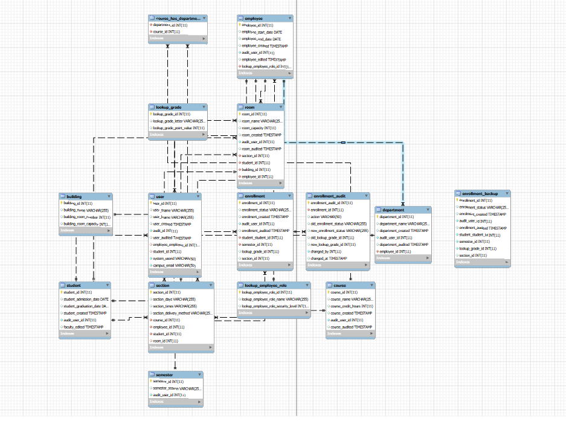
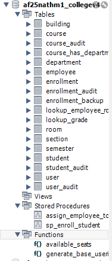

# 📚 Student Information System Database

A relational Student Information System (SIS) database designed for Students, Faculty, and Admins to manage grades, enrollment, courses, rooms, and departments.  
[](#)
[](#)

## Table of Contents

- [Role Features](#role-features)
  - [Students](#students)
  - [Faculty](#faculty)
- [Entity–Relationship Model](#entity–relationship-model)
  - [Diagram](#diagram)
  - [Key Tables](#key-tables)
- [Views](#views)
- [SQL Procedures, Functions & Transactions](#sql-procedures-functions--transactions)
- [Tech Stack](#tech-stack)
- [Setup](#setup)
- [Authors](#authors)

## Role Features

### Students

View grades and enrollment status.

Access course and section details they are linked to.

### Faculty

View and update grades for students they teach.

Manage sections they are assigned to.

View departmental and course relationships.

## Entity–Relationship Model

The schema enforces role-based access, integrity, and scalability.

### Diagram

Below are the exported diagrams from MySQL Workbench. Click the images to view the full-size versions.

[](assets/EER_Diagram.png)  
*EER Diagram — shows tables and relationships.*

[](assets/Catalog_Tree.png)  
*Catalog Tree — shows the list of tables in the generated schema.*

## Key Tables

### Core Tables
- `user` – Authentication & link to student / employee.
- `student` – Admissions, graduation, enrollment link.
- `employee` – Faculty/Admin records with roles.
- `department` – Academic departments.
- `course` – Courses with credit hours.
- `section` – Course offerings, linked to faculty/students.
- `enrollment` – Tracks student enrollment status.
- `semester` – Current and archived academic terms.
- `room` / `building` – Physical classroom resources.
- Lookups – Employee roles, grades.

### Audit Tables (Change Tracking)
- `enrollment_audit` – Tracks all enrollment status and grade changes.
- `course_audit` – Tracks course name and credit hour modifications.
- `student_audit` – Tracks admission and graduation date changes.
- `user_audit` – Tracks user profile, system ID, and email changes.

## Views

The database includes several custom **SQL views** to simplify querying and reporting across core entities like students, instructors, courses, and academic performance. These views were created to answer common questions and support administrative tasks.

### Implemented Views

| View Name | Description |
|------------|-------------|
| `vw_enrollment_details` | Displays each student’s enrollment information, including semester, grade, and status. |
| `vw_course_schedule` | Lists course sections with instructor, room, and building details for scheduling. |
| `vw_student_enrollment_summary` | Summarizes each student’s total, active, and completed enrollments, plus GPA. |
| `vw_department_course_counts` | Shows department heads, total courses offered, and course listings. |
| `sections_with_rooms_view` | Displays which instructors are teaching which courses, in which rooms, and at what times. |
| `graduated_students_high_gpa_view` | Lists all students who have graduated with a GPA above 3.5, including admission and graduation dates. |
| `instructor_by_role_view` | Shows employees with their assigned roles, titles, and personal details. |
| `semesters_by_student_view` | Lists all semesters each student has been enrolled in, including status (Active, Completed, Withdrawn). |

> These views were built using `JOIN`, `GROUP BY`, `HAVING`, and `ORDER BY` clauses, and tested on sample data generated using `INSERT` statements.  
> They are reusable across reporting tools or integrations with front-end dashboards.

## Audit System

The database includes a comprehensive **audit system** to track all changes to critical tables. This includes automatic audit tables, triggers, and scheduled events for change tracking and compliance.

**For detailed audit system documentation, including:**
- How audit tables work
- Trigger reference guide
- System user ID and campus email generation
- Monthly purge events
- Common audit queries
- Best practices and troubleshooting

**See the [Audit System Guide](/assets/AUDIT_SYSTEM_GUIDE.md)**

### Quick Overview

| Audit Table | Source Table | Tracked Changes |
|-------------|-------------|-----------------|
| `enrollment_audit` | `enrollment` | Status changes, grade updates |
| `course_audit` | `course` | Name and credit hour modifications |
| `student_audit` | `student` | Admission and graduation date changes |
| `user_audit` | `user` | User profile, system ID, and email changes |

## Course Audit System (Version 4 Implementation)

### Overview
The Course Audit System provides comprehensive tracking of all changes to course records in the database. It captures who made changes, what changes were made, and when they occurred. This system was implemented as part of the Version 4 requirements.

### Components

#### 1. Course Audit Table (`course_audit`)
This table tracks all modifications to course records with the following structure:
- `course_audit_id`: Unique identifier for each audit record (AUTO_INCREMENT)
- `course_id`: Reference to the course being modified (foreign key to `course` table)
- `action`: Type of operation (INSERT, UPDATE, DELETE)
- `old_course_name` / `new_course_name`: Course name before/after change
- `old_course_credits` / `new_course_credits`: Credit hours before/after change
- `old_audit_user_id` / `new_audit_user_id`: Audit user ID before/after change
- `changed_by`: User who performed the action (extracted from CURRENT_USER())
- `changed_at`: Timestamp of when the change occurred (auto-updates)

**Foreign Key Constraint:**
- References: `course` table, `course_id` column
- Actions: ON DELETE CASCADE, ON UPDATE CASCADE

**Indexes:**
- Primary: `course_audit_id`
- Foreign key: `fk_course_audit_course` on `course_id`
- Performance: `idx_course_audit_changed_at`, `idx_course_audit_action`

#### 2. Triggers for Course Table
Three triggers automatically populate the audit table:

1. **`trg_course_after_insert`**
   - **Type**: AFTER INSERT
   - **Description**: Logs all initial course data when a new course is inserted
   - **Captures**: course_name, course_credits, audit_user_id
   - **User Tracking**: Uses `SUBSTRING_INDEX(CURRENT_USER(), '@', 1)` to capture database user

2. **`trg_course_after_update`**
   - **Type**: AFTER UPDATE
   - **Description**: Logs changes to course records
   - **Smart Filtering**: Only creates audit records when actual data changes occur (excludes timestamp-only updates)
   - **Comparison**: Compares OLD vs NEW values for course_name, course_credits, and audit_user_id
   - **Efficiency**: Prevents unnecessary audit records for updates with no meaningful changes

3. **`trg_course_after_delete`**
   - **Type**: AFTER DELETE
   - **Description**: Preserves deleted course information in the audit trail
   - **Data Preservation**: Captures all course details before deletion
   - **Integrity**: Maintains referential integrity through foreign key constraints

#### 3. Scheduled Event
- **Event Name**: `truncate_course_audit_monthly`
- **Schedule**: Runs EVERY 1 MONTH
- **Start Time**: CURRENT_TIMESTAMP + INTERVAL 1 MINUTE
- **Purpose**: Automatically purges audit records older than 1 month
- **Logic**: `DELETE FROM course_audit WHERE changed_at < DATE_SUB(NOW(), INTERVAL 1 MONTH)`
- **Benefits**: Maintains database performance while preserving recent audit history

### Testing Methodology
The course audit system was tested with multiple scenarios:

1. **INSERT Operations**: Verified new courses generate appropriate audit records
2. **UPDATE Operations**: 
   - Tested with actual data changes (creates audit record)
   - Tested with no data changes (no audit record created)
   - Verified only meaningful changes are logged
3. **DELETE Operations**: Confirmed deleted courses are logged with all details
4. **Data Integrity**: Verified foreign key constraints prevent invalid references
5. **Event Functionality**: Simulated monthly purge to ensure proper old data removal
6. **User Tracking**: Confirmed `changed_by` correctly captures database username

### Usage Examples

#### Viewing Audit History
```sql
-- View complete audit trail for a specific course
SELECT * FROM `course_audit` 
WHERE course_id = 1 
ORDER BY changed_at DESC;

-- View all changes made by a specific user
SELECT * FROM `course_audit` 
WHERE changed_by = 'dejohns2'
ORDER BY changed_at DESC;

-- View recent course modifications
SELECT 
    c.course_name,
    ca.action,
    ca.old_course_name,
    ca.new_course_name,
    ca.changed_by,
    ca.changed_at
FROM `course_audit` ca
JOIN `course` c ON ca.course_id = c.course_id
WHERE ca.action = 'UPDATE'
ORDER BY ca.changed_at DESC
LIMIT 10;
Manual Event Execution
sql
-- Manually trigger the monthly purge (for testing)
DELETE FROM `course_audit` 
WHERE changed_at < DATE_SUB(NOW(), INTERVAL 1 MONTH);
Security and Compliance Features
User Accountability: Automatically captures database user via SUBSTRING_INDEX(CURRENT_USER(), '@', 1)

Data Integrity: Foreign key constraints with CASCADE operations maintain referential integrity

Performance Optimization: Indexed columns ensure efficient querying

Compliance Ready: Complete audit trail supports regulatory requirements

Data Retention: Configurable retention period via scheduled events

Maintenance Considerations
Monthly Purge: Automatic cleanup of old records maintains performance

Index Maintenance: Regular optimization of audit table indexes recommended

Backup Strategy: Audit data included in regular database backups

Monitoring: Regular review of audit table growth and performance metrics

Retention Policy: Configurable through event scheduling parameters

SQL Procedures, Functions & Transactions
The database includes custom stored procedures and functions for common operations:

Custom Functions (FN): fn_get_student_enrollment_count, fn_is_employee_qualified_for_department, fn_get_building_capacity, fn_student_status

Stored Procedures (SP): sp_enroll_student, sp_assign_employee_to_department, sp_assign_room, sp_calculate_student_gpa, sp_get_student_courses, sp_log_enrollment_audit

For detailed usage examples, parameters, and error handling, see the SQL Procedures, Functions & Transactions Guide.

Tech Stack
Database: MySQL / MariaDB

Modeling: MySQL Workbench (Forward Engineering)

Setup
Clone the repository:

Powershell

text
git clone https://github.com/Beast1692/College_V4
cd College_V4
Import the .sql schema into MySQL Workbench.

Run the script to create tables and relationships.

Authors
Nathan Mulholland
Ona Mosadi
